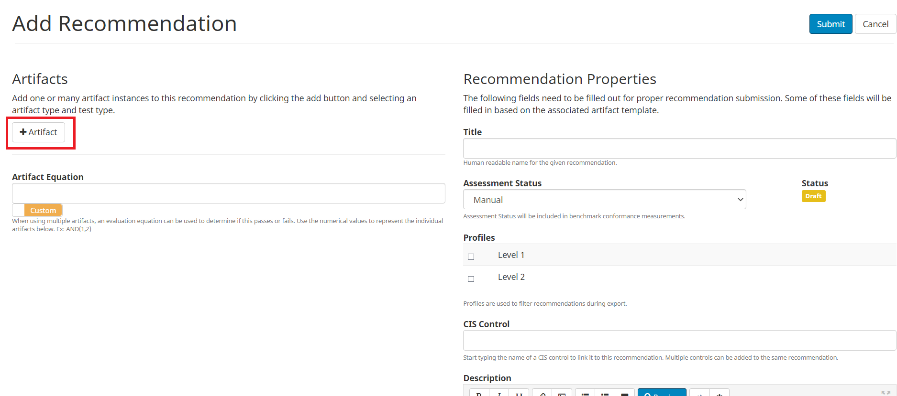
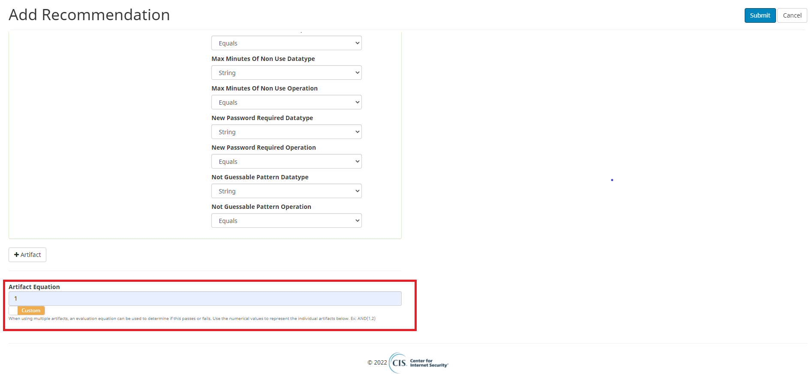

How To
======

The CIS Artifact Expressions documentation is a guide for creating Artifacts during benchmark customization. The documentation is organized by family and broken down by Artifact Types.
This guide will walk you through forking a benchmark and adding a custom recommendation in Workbench using this documentation.

Creating a Recommendation
-------------------------

Forking a Benchmark
^^^^^^^^^^^^^^^^^^^^^^^

1. Navigate to the benchmark you would like to use.

2. In order to make changes to a published benchmark, you must first fork it. Click the ‘Fork’ button.

3. Fill out the required fields.

4. When you’re finished, click ‘Submit’.

Add a Recommendation
--------------------

5. The left pane lists all of the ‘Sections’ of the benchmark. Each recommendation is nested in a particular Section. Use these sections to determine where to place your recommendation. In this example, we are going to create a recommendation that prohibits a user from using the same password more than once. Therefore, we are going to place it in the System Access, Authentication and Authorization > Password Management section.

6. Click ‘Password Management’.

7. Scroll down until you see ‘Recommendations’.

8. Click ‘Add New’.

Choosing an Artifact and Test Type
----------------------------------

- For this example, we will be using the artifact type macos:pwpolicy59. Click below to view the documentation for this artifact:

https://artifact-expressions.readthedocs.io/en/latest/artifacts/macos/macos.pwpolicy59_v1/

9. Click ‘+Artifact’.

10. Choose the artifact type you wish to use from the dropdown menu.

11. Choose the test type you wish to use. If the artifact type is linked to only one test type, you have only one test type to choose from.

12. Fill out the parameter fields. View the parameter requirements for macos:pwpolicy59 in the OVAL Language documentation here: https://artifact-expressions.readthedocs.io/en/latest/artifacts/macos/macos.pwpolicy59_v1/#artifact-parameters Make sure you set ‘Assessment Status’ to ‘Automated’. NOTE: If you would like this Recommendation to be excluded from the CIS-CAT Assessor Tool, set ‘Assessment Status’ to ‘Manual’.

Artifact Equation
-----------------

13. Next, you must add an Artifact Equation. The purpose of the Artifact Equation is twofold: 1) To determine the All Pass All Fail result of the Recommendation in the CIS-CAT Assessor 2) To tell Workbench how multiple artifacts should be evaluated together. The artifact equation is a logical statement consisting of AND, OR, and a number. The number references the artifact. This number can be found in the top left corner of the artifact. See the image below.

In this case, our artifact equation is simply ‘1’. AND(1) would also be acceptable.

If you wanted to add another artifact (and have it evaluated with the first artifact) to the export, the equation would be AND(1,2). If you would like the two artifacts to be evaluated separately, the equation would be OR(1,2). NOTE: Be careful when constructing the artifact equation. An incorrect or incomplete artifact equation will cause the benchmark export to fail. Some common examples of an incorrect or incomplete artifact equation include missing a parenthesis or referencing an artifact that does not exist in the recommendation (for example, AND(1,3) would fail if there were only two artifacts in the recommendation).

Finish and Review Recommendation
--------------------------------

14. When you’re finished, click ‘Submit’.

15. Your recommendation is now included in the benchmark.

16. Scroll down to view the artifact(s)' details at a glance.

Review what the generated content for the macos:pwpolicy59 artifact type should look like here:

https://artifact-expressions.readthedocs.io/en/latest/artifacts/macos/macos.pwpolicy59_v1/

